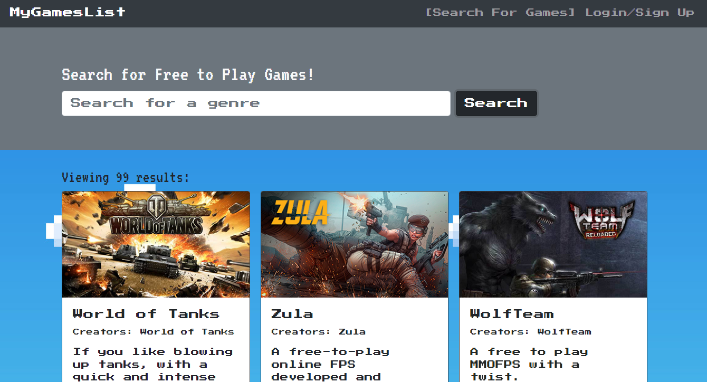

# MyGamesList

  

  ***
  ## Table of Contents
  - [Description](#description)
  - [Visual Presentation](#visual-presentation)
  - [Technologies Used](#technologies-used)
  - [Installation](#installation)
  - [Usage](#usage)
  - [Contribution](#contribution)
  - [Testing](#testing)
  - [Additional Info](#additional-info)

  ***
  ## Description
  A program that allows you to search through a public game api. You can only search by genre, you can also create a user profile to save which games you want to try. You can delete games that you are no longer interested in. The search window is very simple and so is the interface to add and delete games.

  ***
  ## Technologies Used
  React, Graphql, mongoDB, Apollo

  ***
  ## Visual Presentation
  

  ***
  ## Installation
  You have to clone the respository and npm start both the server and client folders. No deployable, but if you need I can deploy it on heroku.

  ***
  ## Usage
  Searching for free-to-play games

  ***
  ## Bugs
  Somtimes the local storage isn't cleared when it should be. When you delete a game from your user profile. The game when searched again is locked out on 'Already saved' not sure where the problem is. I spent a bunch of time trying to fix that but the 2 hour limit ran out.

  ***
  ## Improvements
  Fixing the local storage would be my first priority, other improvements I would do are allowing the user to use a rating system, maybe a favorites button as well. Maybe a better api so you can search for specific games, or names of games instead of being locked to genre only. Allow a search through your saved games and favorite games. 

  ***
  ## Additional Info
  - Github: 
      - Korey Luu(https://github.com/Ahrionic)

